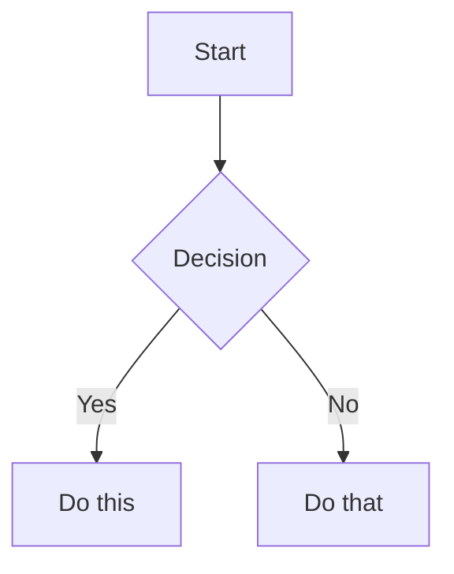

# Markdown — Complete Notes (Beginner to Advanced)

---

## 1. BEGINNER

### 1.1 Headings
Use `#` for headings. One `#` = H1, up to six `#` = H6.

```markdown
# H1 Heading
## H2 Heading
### H3 Heading
#### H4 Heading
##### H5 Heading
###### H6 Heading
```

Alternate syntax (only for H1/H2):
```markdown
Heading 1
=========

Heading 2
---------
```

### 1.2 Paragraphs and Line Breaks
- Leave a blank line between paragraphs.
- To force a line break, end a line with **two or more spaces**, or use `<br>`.

```markdown
This is line one.  
This is line two (note two trailing spaces above).
```

### 1.3 Emphasis
```markdown
*italic* or _italic_
**bold** or __bold__
***bold italic***
~~strikethrough~~
```

### 1.4 Lists

**Unordered:**
```markdown
- Item one
- Item two
  - Nested item
* Also works with *
+ Also works with +
```

**Ordered:**
```markdown
1. First
2. Second
   1. Nested
3. Third
```

### 1.5 Links and Images
```markdown
[Link text](https://example.com)
[Link with title](https://example.com "Hover title")


```

### 1.6 Blockquotes
```markdown
> This is a quote.
> It can span multiple lines.
>
> > Nested quote.
```

### 1.7 Horizontal Rule
```markdown
---
***
___
```

### 1.8 Inline Code
```markdown
Use the `printf()` function.
```

---

## 2. INTERMEDIATE

### 2.1 Code Blocks
Fenced with triple backticks, with optional language for syntax highlighting.

````markdown
```python
def hello():
    print("Hello, world!")
```
````

Indented code blocks (4 spaces) also work but are less common now.

### 2.2 Tables
```markdown
| Name  | Age | City     |
|-------|-----|----------|
| Alice | 30  | Mumbai   |
| Bob   | 25  | Delhi    |
```

**Column alignment:**
```markdown
| Left | Center | Right |
|:-----|:------:|------:|
| a    |   b    |     c |
```

### 2.3 Task Lists (GFM — GitHub Flavored Markdown)
```markdown
- [x] Completed task
- [ ] Incomplete task
- [ ] Another task
```

### 2.4 Reference-Style Links
Useful for reusing the same link or keeping text clean.
```markdown
Visit [my site][1] or [my site again][1].

[1]: https://example.com "Optional title"
```

### 2.5 Escaping Characters
Use `\` before a special character to display it literally.
```markdown
\*not italic\*
\# not a heading
```

Special characters that often need escaping: `\ ` `` ` `` `*` `_` `{}` `[]` `()` `#` `+` `-` `.` `!`

### 2.6 Automatic Links
```markdown
<https://example.com>
<email@example.com>
```

### 2.7 Definition Lists (extended syntax, not all renderers support it)
```markdown
Term
: Definition one
: Definition two
```

---

## 3. ADVANCED

### 3.1 Footnotes (extended syntax)
```markdown
Here is a statement needing a citation.[^1]

[^1]: This is the footnote text.
```

### 3.2 HTML Inside Markdown
Most Markdown renderers allow raw HTML for things Markdown can't do natively.
```markdown
<div style="color:red">
  This is raw HTML inside Markdown.
</div>

Press <kbd>Ctrl</kbd> + <kbd>C</kbd> to copy.
```

### 3.3 Nested Content Inside Lists
Indent by 4 spaces (or one tab) to nest code blocks, quotes, or paragraphs inside a list item.

````markdown
1. First step

   ```bash
   echo "run this command"
   ```

2. Second step

   > A note relevant to this step.
````

### 3.4 Collapsible Sections (HTML + Markdown combo)
```markdown
<details>
<summary>Click to expand</summary>

Hidden content goes here, including **Markdown formatting**.

</details>
```

### 3.5 Diagrams with Mermaid (supported on GitHub, many docs tools)
````markdown

````

### 3.6 Math (via KaTeX/MathJax, common in Jupyter, GitHub, Obsidian)
```markdown
Inline math: $E = mc^2$

Block math:
$$
\int_0^\infty e^{-x} dx = 1
$$
```

### 3.7 Front Matter (YAML metadata — used by static site generators like Jekyll, Hugo)
```markdown
---
title: "My Post"
date: 2026-08-25
tags: [markdown, notes]
---

Content starts here.
```

### 3.8 Anchors and Internal Links
Headings auto-generate anchors (lowercase, spaces → hyphens).
```markdown
[Jump to Tables](#22-tables)
```

### 3.9 Emoji Shortcodes (GFM, Slack, Discord)
```markdown
:smile: :rocket: :tada:
```

### 3.10 Line Breaks vs Hard Breaks — Best Practice
- Use trailing double-space or `<br>` for hard breaks inside a paragraph.
- Prefer separate paragraphs (blank line) over hard breaks for readability and portability across renderers.

### 3.11 Comments (not rendered, HTML-based)
```markdown
<!-- This is a comment and will not be displayed -->
```

---

## 4. Quick Reference Cheat Sheet

| Element        | Syntax                          |
|-----------------|----------------------------------|
| Heading         | `# H1` … `###### H6`            |
| Bold            | `**bold**`                      |
| Italic          | `*italic*`                      |
| Strikethrough   | `~~text~~`                      |
| Link            | `[text](url)`                   |
| Image           | ``                   |
| Blockquote      | `> quote`                       |
| Inline code     | `` `code` ``                    |
| Code block      | ` ```lang ... ``` `             |
| Unordered list  | `- item`                        |
| Ordered list    | `1. item`                       |
| Task list       | `- [ ] task`                    |
| Table           | `\| col \| col \|`              |
| Horizontal rule | `---`                           |
| Footnote        | `[^1]`                          |

---

## 5. Notes on Compatibility
- **CommonMark**: the standardized base spec most tools follow.
- **GFM (GitHub Flavored Markdown)**: adds tables, task lists, strikethrough, auto-links.
- Extended features (footnotes, math, Mermaid, definition lists) depend on the specific renderer (GitHub, GitLab, Obsidian, Notion, VS Code, etc.) — always check what your target platform supports before relying on advanced syntax.
